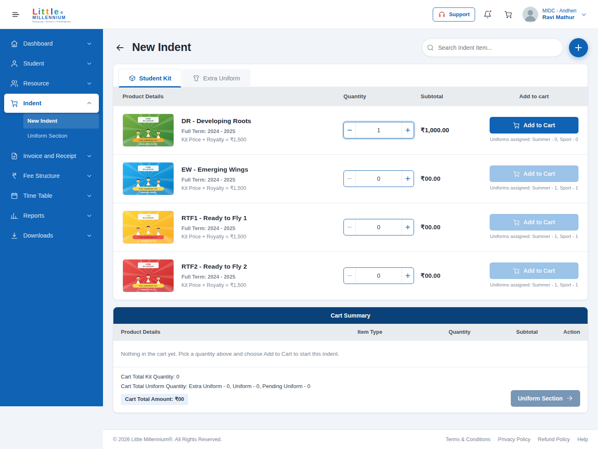

# Student Kit Indent — Angular Development Task

An implementation of the **New Indent → Student Kit** screen from the provided design, built with
Angular 20 standalone components, signal-based state and reactive forms.

The screen is fully interactive, not a static mock-up: quantities validate, the cart totals update
live, the Extra Uniform tab and the Uniform Section step are wired to the same store, and the layout
works from a 1440 px desktop down to a 360 px phone.



---

## 1. Tech stack

| Item | Version / choice |
| --- | --- |
| Angular | **20.3** (standalone components, no NgModules) |
| Angular CLI | 20.3 |
| TypeScript | 5.9 |
| Node.js | 20.19+ or 22+ (built and tested on Node 22) |
| Styling | **SCSS**, hand-written, with CSS custom properties for design tokens |
| State | Angular **signals** (`signal` / `computed`) in a root-provided store |
| Forms | `@angular/forms` reactive forms + a custom `ControlValueAccessor` |
| Testing | Karma + Jasmine (23 unit tests) |

### Third-party libraries

**None.** No UI kit, no icon font, no CSS framework, no state-management library. Everything —
layout, icons, stepper, toasts, skeleton loaders, currency formatting — is written with Angular and
the standard library only, so nothing outside `@angular/*`, `rxjs`, `tslib` and `zone.js` appears in
`package.json`.

---

## 2. Run it

```bash
# 1. install
npm install

# 2. start the dev server
npm start          # http://localhost:4200

# 3. production build
npm run build      # output in dist/student-kit-indent/browser

# 4. unit tests
npm test           # watch mode (opens Chrome)
npm run test:ci    # single run, headless Chrome
```

The app opens on `/indent/new`, which is the screen in the design.

### Deploying

The build output is a plain static bundle, so any static host works:

```bash
npm run build
# then upload dist/student-kit-indent/browser to Netlify / Vercel / S3 / IIS
```

Add `--base-href /<sub-folder>/` to the build command if it is not served from the domain root, and
point the host's SPA fallback (rewrite rule) at `index.html` so deep links such as
`/indent/uniform-section` resolve.

---

## 3. What is implemented

**New Indent screen (`/indent/new`)**

- Topbar with menu toggle, brand, Support, notifications, a live cart badge and a profile menu.
- Collapsible sidebar; on tablet and phone it becomes an off-canvas drawer with a scrim.
- Page header with back button, live search (debounced, 200 ms) and the round add button.
- **Student Kit** tab — the four kits from the design, each with image, code and name, term,
  "Kit Price + Royalty", quantity stepper, live subtotal, assigned-uniform note and Add to Cart.
- **Extra Uniform** tab — uniforms that can be ordered on top of the kit allocation, with a
  mandatory size selection per line.
- **Cart Summary** — line items with type, quantity, subtotal and remove, plus the three total rows
  and the Uniform Section call to action, laid out as in the design.
- Loading skeletons while the catalogue resolves, empty states for the cart and for a search that
  matches nothing, and toast feedback for every cart action.

**Uniform Section screen (`/indent/uniform-section`)**

- One size selector for every uniform the cart's kits entitle the centre to, grouped by kit.
- "Apply to all pending" bulk action.
- Review panel with the running totals; **Place indent** stays disabled until every uniform has a
  size, then clears the cart and confirms with the generated indent reference.

Every other sidebar entry routes to a placeholder page so no link dead-ends.

---

## 4. How the design was read

Three details in the screenshot drove the data model, and they are worth calling out because they
are easy to miss:

1. **Kit price and royalty are different numbers.** The row prints
   `Kit Price + Royalty = ₹1,500` but a quantity of 1 subtotals to `₹1,000.00`. So the kit is
   ₹1,000, the royalty is ₹500, and only the kit price is billed on the indent line. The model keeps
   `kitPrice` and `royalty` separate and the subtotal uses `kitPrice × quantity`.
2. **Choosing a quantity is not adding to the cart.** The screenshot shows quantity 1 on the first
   row while `Cart Total Kit Quantity` is still 0. Quantity lives in the form; the cart only changes
   when Add to Cart is pressed. After a successful add the row resets to 0 and shows an "in cart"
   badge instead.
3. **Zero has its own format.** The design prints `₹00.00` in the subtotal column and `₹00` for the
   cart total, not `₹0.00`. The `inr` pipe reproduces that, and uses Indian digit grouping
   (`₹1,50,000.00`) everywhere else.

`Pending Uniform` is modelled as a uniform that a kit in the cart entitles the centre to but which
has no size assigned yet — that is what the Uniform Section screen exists to clear.

---

## 5. Architecture

```
src/app
├── core/                            # no UI, imported by features
│   ├── data/indent-catalog.ts       # catalogue fixture (kits, uniforms, sizes)
│   ├── models/indent.models.ts      # StudentKit, ExtraUniform, CartLine, UniformSlot, CartTotals
│   └── services/
│       ├── cart.store.ts            # signal store: single source of truth for the indent
│       ├── indent-catalog.service.ts# read side; swap of(...) for HttpClient to go live
│       ├── layout.store.ts          # sidebar / drawer state
│       └── toast.service.ts         # transient feedback queue
├── layout/                          # application chrome
│   ├── shell/                       # topbar + sidebar + router outlet + footer
│   ├── sidebar/                     # accordion navigation (nav-items.ts holds the structure)
│   └── topbar/
├── shared/                          # reusable, feature-agnostic
│   ├── components/icon/             # inline SVG icon set (no icon font)
│   ├── components/quantity-selector/# stepper implementing ControlValueAccessor
│   ├── components/toast-host/
│   ├── components/page-placeholder/
│   └── pipes/inr.pipe.ts
└── features/indent/                 # the feature itself, lazy loaded
    ├── indent.routes.ts
    ├── pages/new-indent/
    ├── pages/uniform-section/
    └── components/                  # student-kit-list, extra-uniform-list, kit-row,
                                     # uniform-row, cart-summary
```

**Conventions used throughout**

- Standalone components only; `ChangeDetectionStrategy.OnPush` on every component.
- Feature routes are **lazy loaded** (`loadChildren` → `loadComponent`), so the initial bundle
  carries only the shell.
- Signal inputs (`input()`) and outputs (`output()`); rows are presentational and emit intent
  upwards, while the list components own the form and talk to the store.
- The store never exposes a writable signal: state is private, `computed` values are public, and
  changes go through methods (`addKit`, `updateQuantity`, `setUniformSize`, `removeLine`, `clear`).
- Derived numbers are never stored. `uniformQuantity`, `pendingUniformQuantity` and the amount are
  all `computed`, so they cannot drift from the lines.
- Uniform sizes are keyed separately from cart lines, so raising a kit's quantity keeps the sizes
  already chosen.

### State management

`CartStore` is provided in root and holds two private signals — the cart lines and the size map.
Everything the UI renders is derived from them:

```
lines ─┬─► kitLines ─────► uniformSlots ─┬─► totals.uniformQuantity
       │                                 └─► totals.pendingUniformQuantity ─► canPlaceIndent
       ├─► extraUniformLines ───────────────► totals.extraUniformQuantity
       └───────────────────────────────────► totals.amount, itemCount (topbar badge)
```

Signals were chosen over a Redux-style library because the state is small and local to one feature;
the same shape ports to NgRx SignalStore later without touching the components.

---

## 6. Validation

| Field | Rules | Behaviour |
| --- | --- | --- |
| Kit quantity | `required`, `min 0`, `max 5` | Typed values are *not* silently corrected — an out-of-range value shows "Maximum 5 kits per line.", the field turns red and Add to Cart is disabled. The − / + buttons stay inside the range and disable at the limits. |
| Extra uniform size | `required` | Add to Cart stays disabled until a size is chosen; touching and leaving the field shows "Select a size." |
| Extra uniform quantity | `required`, `min 0`, `max 10` | Same treatment as kit quantity. |
| Uniform sizes (Uniform Section) | every slot needs a size | Place indent is disabled while any slot is pending; pressing it marks the unfilled slots in red. |
| Search | none | Trimmed, case-insensitive, debounced 200 ms, matches code or name. |

Non-digit characters are stripped as they are typed, and an emptied field falls back to 0 on blur.

---

## 7. Responsive behaviour

| Breakpoint | Layout |
| --- | --- |
| ≥ 1200 px | Full design: fixed sidebar, four-column kit table, five-column uniform table. |
| 992 – 1199 px | Uniform table folds to two rows per item; sidebar can be collapsed to an icon rail. |
| < 992 px | Sidebar becomes an off-canvas drawer with a scrim; table headers drop and each row becomes a card with inline labels. |
| < 576 px | Single-column rows, full-width actions, condensed topbar (brand, icons and cart only). |

---

## 8. Accessibility

- Landmarks (`header`, `nav`, `main`, `footer`), `role="tablist"` / `role="tab"` on the tabs and
  `aria-selected` / `aria-expanded` state on the tabs and sidebar groups.
- Every icon-only control has an `aria-label`; decorative SVG is `aria-hidden`.
- Visible focus ring on all interactive elements, Escape closes the profile menu, toasts announce
  through `role="status"` + `aria-live="polite"`.
- Invalid fields set `aria-invalid` and pair with a visible message.
- `prefers-reduced-motion` disables animations.

---

## 9. Tests

23 unit tests, all passing:

- `cart.store.spec.ts` (13) — billing the kit price and not the royalty, merging repeat additions,
  the per-line maximum, uniform-slot generation, pending counts, size retention when a quantity
  grows, size-specific uniform lines, removal and combined totals.
- `quantity-selector.component.spec.ts` (6) — the `ControlValueAccessor` contract: writing values
  in, emitting on step, boundary disabling, digit filtering, blur fallback, disabled state.
- `inr.pipe.spec.ts` (5) — the `₹00.00` / `₹00` placeholders, null handling, decimals and lakh
  grouping.

```bash
npm run test:ci
```

(Inside a root container add `--no-sandbox`: `ng test --watch=false --browsers=ChromeHeadlessNoSandbox`.)

---

## 10. Assumptions and scope

- **No backend was provided**, so `IndentCatalogService` returns the catalogue from a fixture behind
  a small `delay()` to exercise the loading states. It returns `Observable`s specifically so it can
  be swapped for `HttpClient` without changing a single component.
- **Images and the logo are placeholders** generated as SVG for this submission; the real brand
  assets can be dropped into `public/assets/` under the same file names.
- The design only shows the Student Kit tab. The **Extra Uniform** tab and the **Uniform Section**
  screen follow the same visual language and the data hinted at in the design ("Uniforms assigned:
  Summer - 1, Sport - 1" and the Pending Uniform counter).
- Kit quantity is capped at 5 per line, matching the range offered by the quantity control in the
  design; extra uniforms are capped at 10.
- Sidebar entries other than Indent, and the Support / notification / footer links, open a short
  notice rather than a fabricated screen.
- Cart state is in memory for the session; nothing is persisted to `localStorage` or a server.
